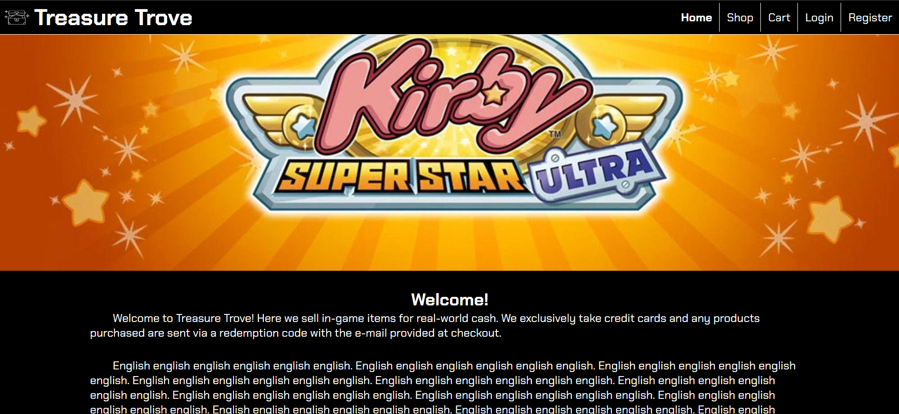
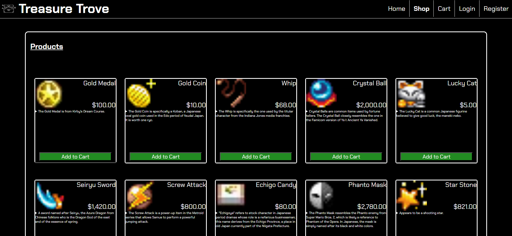
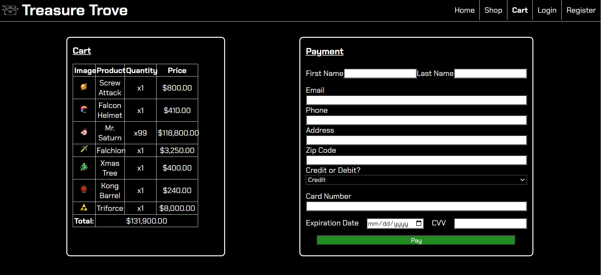
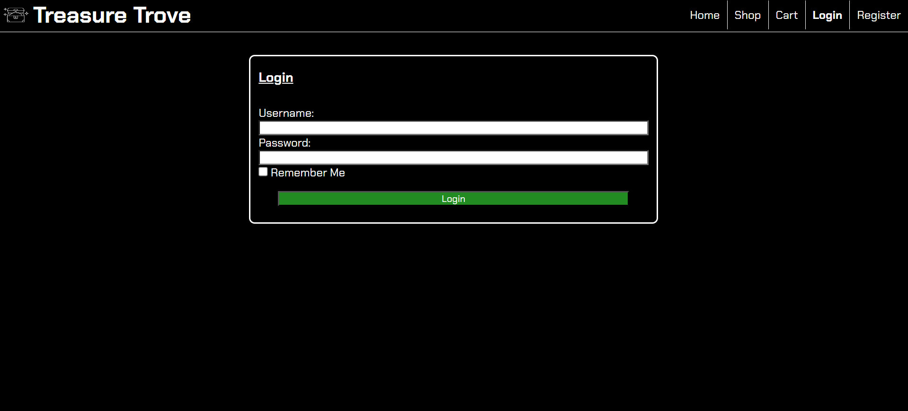
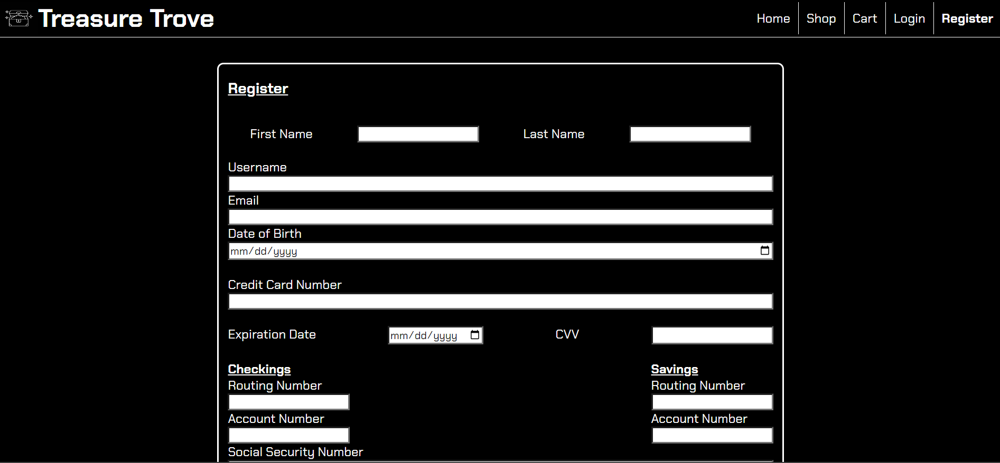
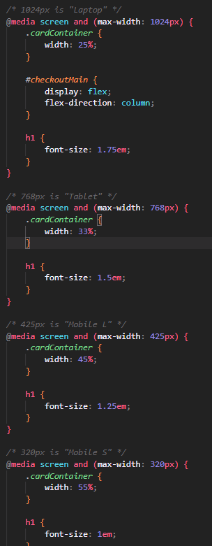

Treasure Trove
===
This is a small project utilizing HTML and CSS to make an e-commerce website. I utilized inputs and their types, media queries, semantic tags, pseudoclass, and various other HTML and CSS properties to realize the result.

## Home Page

The homepage shows a simple hero image that grows & shrinks with the window and some simple text about the concept of this shop named "Treasure Trove". It also displays the header/nav bar that accompanies all pages. This remains locked to the top, even when scrolling.

## Shop Page

The shop page displays 60 items available for purchase, including their images, names, prices, and descriptions. In addition, each card has its own button to "Add to Cart" that, while not adding a given item to the cart, does redirect to the checkout page.

## Cart Page

The cart page is fairly straightforward. A table element was used to neatly organize and display sample data of what could go in a user's cart. The payment section also makes use of the select tag to create a drop-down menu for an option of "Credit" or "Debit".

## Login Page

The login page is a simple form with four key parts: a field for the user's username, their password, a decorative (as in: not functional) checkbox to have that information saved for ease of access, and a submit button that simply redirects to the home page.

## Register Page

The register page, while not the prettiest page you've ever seen, makes effective use of input tags' existing attributes to create a functioning form that can handle emails, passwords, dates, and numbers each as appropriate.

## A cool piece of CSS

I like the code above because it uses both media queries and the cascade to achieve the desired result. In this case, many of these can be true at one time but when given conflicting information on how to style something, CSS only applies the most recent styles it receives. Therefore, the order of these rules is crucial for achieving the outcome in question.